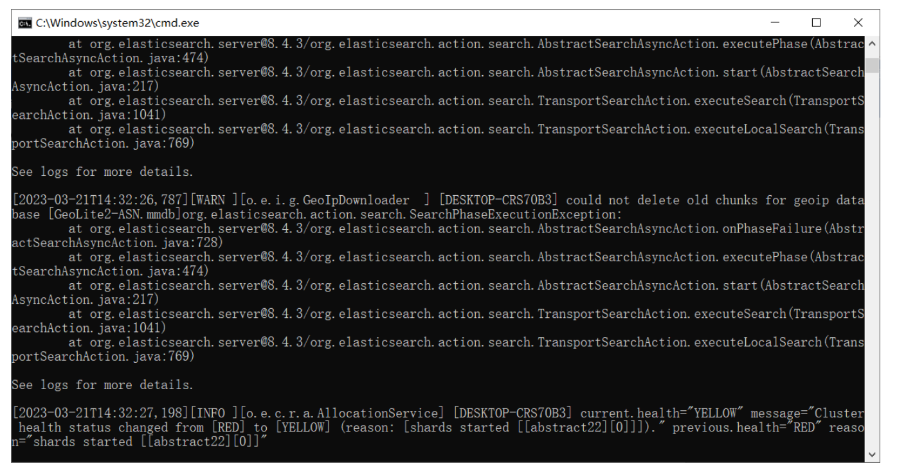
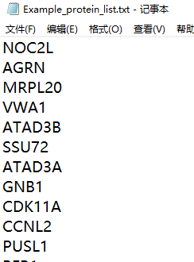

## 目录

[背景](#背景)
- [现存问题](#现存问题)
- [优化方案](#snoopy的方案)

[安装](#安装)

[使用](#使用)
- [数据](#数据)
- [使用](#使用)

[附：OTTM本地端使用方法](#附ottm本地端使用方法)

## 背景
[OTTM项目](https://github.com/YXB-OTTM/OTTM)给出一个很有趣的思路，基于文献计量学进行“以靶找药”的药物推荐。

### 现存问题：
- 未在github中给出数据以及版本要求
- 其使用的远程Elasticsearch实例运行在另一台电脑上或云服务器上，但是未给出那台服务器的地址和端口来连接。其可视化方案
- 网站[otter-simm](http://otter-simm.com/ottm.html)缺少维护
- 可视化方案由于版本兼容问题无法正常运行

### [Snoopy](https://github.com/Carrie-HuYY/Snoopy)的方案：

- 更改其使用的Elasticsearch，采用本地端知识图谱形式保存数据
- 优化代码结构，提高代码可读性，便于本地运行
- 优化可视化方案
- 包装成Python包的形式
- 更新README文档

## 安装

## 使用

Snoopy包含三个主程序：
- PDDR.py：(Protein_Driven_Drug_Targeting.py, PDDR)配置环境，生成代码运行流。

- get.py:读取目标靶点以及PPI列表以进行后续分析
  - get_drug_report_info:
  - get_drug_frequency
  - get_PPI_Symbol_List
  - get_Symbol
  - get_txt
  

- analysis.py:
  - classify_targets:据给定的 Symbol_To_Target 字典和 Symbol_list 列表，对靶标（targets）进行分类
  - classify_targets_html:将html中的数据进行更改后输出
  - query_target:查询既要满足摘要在限定的列表中 又要满足这些摘要中存在HCC这个词组，还要在全部的摘要中输入的symbol和uniprotID
  - report_info:通过摘要中的关键词进行查询，将靶标分为对于该疾病报道过的靶标和没有报道过的靶标

- output.py:
  - all_targets_tree:
  - get_excel
  - get_sunburst_tree_bar
  - sort_targets
  - get_sunburst

### 

## 数据

### 附：OTTM本地端使用方法

#### 1. 数据下载
从[OTTM官网](http://otter-simm.com/downloads.html)下载以下两个文件，
并且将其解压到相同的文件夹中，数据展示如下：

| Data      | 描述            | 压缩文件名          | 解压后文件名              |
|-----------|---------------|----------------|---------------------|
| 2023-3-20 | Abstract Data | OTTM_AD_20230320 | elasticsearch-8.4.3 |
| 2023-3-20 | Local Program | OTTM_LP_20230320 | Local OTTM          |

[OTTM_AD_20230320.zip](https://pan.baidu.com/s/12gSqSnTNkKnfcv45qul-JA?pwd=r314)
(**提取码: r314**)

[OTTM_LP_20230320.zip](https://pan.baidu.com/s/1PioCFwmTPOuv9Ib02yGPmA?pwd=swvy)
(**提取码: swvy**)

#### 2. 启动搜索引擎
首先打开`elasticsearch-8.4.3`中的`bin`文件夹，运行`elasticsearch.bat`程序，
最后运行结果如下：

#### 3. 数据输入
打开`Local OTTM` 文件夹然后把待分析的蛋白质组学数据，以txt格式放入文件夹，并将第一列
作为蛋白质的符号名称，范例如下：

#### 4. 开始运行
双击`Protein_Driven_Drug_Targeting.exe`，等待运行结束后，可以在`ouput`文件夹中看到结果

#### 5.结果分析
- 结果会根据配置中的输入参数（报告的数字）生成具有不同名称的文件夹。 
- 进一步的结果分为直接来自用户输入的蛋白质列表和通过蛋白质相互作用获得的PPI蛋白质列表。
每个文件夹的名称是推荐靶标的名称，文件夹中包含与该靶标对应的药物信息和药物的热度。
- 最后三个html文件显示了完整的靶点分类信息和编号，以及OTTM最终推荐的靶点和对应的药物。
